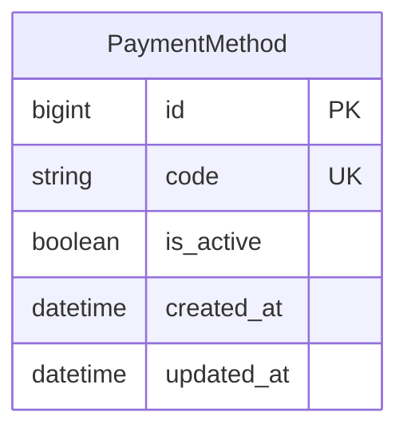

# Глобальная доступность способов оплаты — архитектура

- **Статус:** approved
- **Scope revision:** 2
- **Трассируемые требования:** BR-001–BR-006, AC-001–AC-008
- **Основание:** утверждены `business.md` и подход с отдельной глобальной
  моделью поддержанных способов оплаты; пользователь отдельно подтвердил
  оформление этой спецификации.

## 1. Границы и выбор решения

Изменение остаётся внутри существующего `apps.payments` и платёжной части
Telegram-бота. База данных является source of truth для глобальной активности
способов оплаты. Существующие product endpoints передают активные коды вместе с
данными товара, а бот строит по ним три текущие клавиатуры оплаты.

Выбран минимальный вариант:

1. отдельная модель `PaymentMethod` с одной строкой на поддержанный кодом способ;
2. admin редактирует только унаследованный `is_active`;
3. selector возвращает активные коды в фиксированном порядке;
4. существующий product response получает поле `payment_methods`;
5. MTProxy, VPN и gift читают этот ответ при каждом новом открытии экрана.

Рассмотренные, но отклонённые варианты:

- поля `stars_enabled` и `crypto_pay_enabled` в singleton-настройке требуют
  нового поля и отдельных ветвей для каждого будущего поддержанного провайдера;
- динамический справочник с редактируемыми label, callback и order допускает
  неработающие кнопки и фактически создаёт запрещённый plugin framework;
- отдельный endpoint способов оплаты добавляет сетевой контракт, хотя коды
  можно вернуть с уже требуемыми экрану данными товара.

Не вводятся кеш, новый service/task/exception, новое Django-приложение, общий
provider interface или per-product связь. Цена, invoice, fulfilment и результат
действующих Stars и Crypto Pay flows остаются неизменными.

## 2. Хранение и admin

### `PaymentMethod`

Новая модель находится в `apps.payments`, наследует `BaseDjangoModel` и содержит
только одно собственное поле:

| Поле | Тип | Назначение |
|---|---|---|
| `code` | `CharField(max_length=32, unique=True)` | Стабильный код поддержанного способа: `stars` или `crypto_pay` |
| `is_active` | inherited `BooleanField` | Единственная глобальная доступность способа для всех продуктов |
| `created_at`, `updated_at` | inherited timestamps | Стандартные служебные даты |

Допустимые choices модели используют существующие значения
`PaymentProviderEnum.STARS` и `PaymentProviderEnum.CRYPTO_PAY`. Поля `label`,
`order`, credentials и FK на `Product` отсутствуют. Поэтому одно значение
`is_active` одновременно действует для MTProxy, VPN и gift, а модель не создаёт
per-product конфигурацию.



У `PaymentMethod` намеренно нет связи с `Product` или платёжными сущностями.

### Django admin

`PaymentMethodAdmin`:

- показывает `code`, `is_active` и `updated_at`;
- разрешает независимо менять только `is_active`, в том числе из changelist;
- показывает `code` read-only;
- возвращает `False` из `has_add_permission` и `has_delete_permission`;
- отключает actions, чтобы не оставлять bulk-delete поверхность.

Admin тем самым не позволяет создать произвольный третий способ, удалить
поддержанную строку, переименовать код или изменить отображение. Прямые записи в
БД не являются admin-сценарием, а selector всё равно исключает неизвестные коды.

Трассировка: BR-001, BR-002, BR-005; AC-001, AC-003, AC-007.

## 3. Selector и фиксированный порядок

В `apps.payments.selectors` добавляется
`get_active_payment_method_codes() -> tuple[str, ...]`. Он:

1. использует `PaymentMethod.objects.active()`;
2. ограничивает выборку allowlist поддержанных кодов `stars`, `crypto_pay`;
3. сортирует через фиксированный `Case/When`: Stars, затем Crypto Pay;
4. возвращает только коды, без ORM-моделей за пределами backend.

Порядок не хранится и не редактируется в БД. Даже если физический порядок строк
или порядок их создания отличается, API при двух активных способах всегда
возвращает Stars перед Crypto Pay.

Будущий провайдер получает одну такую же глобальную строку только после
реализации его кода, добавления в allowlist/order и bot mapping. Отдельные
настройки трёх продуктов и универсальная динамическая регистрация не появляются.

Трассировка: BR-001, BR-005; AC-002, AC-003, AC-007.

## 4. API-контракт и backend data flow

Новый endpoint не создаётся. Оба существующих защищённых маршрута сохраняются:

- `GET /api/v1/payments/` для `mtproto_30d`;
- `GET /api/v1/payments/products/<code>/`, включая `vpn_30d`.

В их текущий ответ добавляется одно поле:

```json
{
  "title": "MTPRoto Proxy — 30 дней",
  "description": "Прокси-ссылка на 30 дней для Telegram",
  "currency": "RUB",
  "provider_data": {},
  "send_email_to_provider": true,
  "need_email": true,
  "price": 99.00,
  "stars_price": 99,
  "payment_methods": ["stars", "crypto_pay"]
}
```

`payment_methods` — упорядоченный список только активных поддержанных кодов.
Валидные текущие значения:

- `["stars", "crypto_pay"]`;
- `["stars"]`;
- `["crypto_pay"]`;
- `[]`.

`ProductAPIView` на каждом GET получает товар существующим
`get_active_product_by_code`, затем вызывает новый selector способов. Результат
передаётся в `GetProductSerializer` через serializer context; ORM-запрос из
serializer не выполняется.

Поле аддитивно: текущий bot игнорирует лишний JSON key. Существующие поля и
ошибка неактивного/отсутствующего товара не меняются. Product response не
проверяет вид покупки и не создаёт per-product состояние.

```text
Admin save
  -> PaymentMethod.is_active в БД
  -> новое открытие экрана
  -> существующий product GET
  -> Product + ordered payment_methods
  -> bot DTO
  -> известные кнопки текущего экрана
```

Трассировка: BR-001, BR-003; AC-003, AC-004, AC-006.

## 5. Bot data flow и композиция экранов

Существующий `StarsInvoice` в payment domain client расширяется полем
`payment_methods: tuple[str, ...]`; новый DTO или дополнительный HTTP client не
нужен. Метод `_get_stars_invoice` читает список из того же product response, из
которого уже строит Stars invoice data.

При новом открытии экрана:

| Экран | Product GET | Текущие callbacks |
|---|---|---|
| MTProxy / продление | `/api/v1/payments/` | `pay_stars`, `pay_crypto` |
| VPN | `/api/v1/payments/products/vpn_30d/` | `vpn_pay_stars`, `vpn_pay_crypto` |
| Подарочный сертификат | `/api/v1/payments/` | `gift_stars`, `gift_crypto` |

VPN уже запрашивает товар при открытии экрана. MTProxy `boost_paid` и gift
`gift_certificate` начинают получать тот же MTProxy product перед построением
клавиатуры. Каждый экран выполняет один product GET, содержащий и данные товара,
и способы; отдельного запроса конфигурации нет.

Три существующих keyboard builder принимают `payment_methods` и используют
только известные code-to-button mappings. Labels, styles, callbacks и цена в
текущих кнопках не меняются. Builder всегда добавляет известные способы в
порядке Stars, затем Crypto Pay, независимо от порядка входного iterable, и
сохраняет существующую кнопку «Назад».

Если активен один способ, отображается только его платёжная кнопка. Если список
пуст, handler:

- выводит точный текст `Оплата временно недоступна`;
- не добавляет платёжных кнопок;
- оставляет соответствующую текущему экрану кнопку «Назад».

Пустое состояние определяется по успешно полученному списку, а не по ошибке
backend. Неизвестный bot-у код не порождает произвольный callback.

Обработчики `pay_*`, `vpn_pay_*` и `gift_*` не получают проверку текущего
`is_active`. Кнопка в уже отрисованном старом сообщении продолжает запускать
существующий Stars или Crypto Pay flow, что соответствует AC-008. При новом
открытии экран перечитывает актуальное состояние.

Трассировка: BR-001, BR-003, BR-004; AC-002–AC-004, AC-006, AC-008.

## 6. Ошибки, конкурентность, безопасность и наблюдаемость

### Ошибки

- успешный product response с `payment_methods=[]` является бизнес-состоянием
  «всё выключено» и даёт точный zero-state;
- ошибка БД/backend, malformed response или отсутствующий активный `Product` не
  маскируются под пустое состояние, а проходят текущую обработку API errors;
- новых доменных исключений и retry-механизмов не требуется;
- неизвестная строка в таблице отсекается backend allowlist и не попадает в API.

### Конкурентность и консистентность

Обычный commit admin-сохранения является границей видимости. Параллельный GET
видит старое или уже сохранённое значение; после commit следующий GET видит
новое. Атомарное массовое переключение нескольких способов не требуется:
каждая строка управляется независимо. Кеш отсутствует, поэтому нет TTL или
необходимости перезапуска процессов.

### Безопасность

Product endpoints сохраняют существующую защиту `Bot-Auth-Token`. Модель не
хранит provider credentials, tokens или runtime configuration. Admin permissions
ограничивают mutations только изменением `is_active` существующих строк.

### Наблюдаемость

Текущее состояние и `updated_at` видны в Django admin. Новые логи, метрики,
audit table или alert-задачи для двух boolean switches не вводятся.

## 7. Миграция, rollout и rollback

Аддитивная schema/data migration:

1. создаёт таблицу `PaymentMethod`;
2. через historical model выполняет `get_or_create` для `stars` с
   `defaults={"is_active": True}`;
3. тем же способом создаёт `crypto_pay` активным.

Используется `get_or_create`, а не `update_or_create`: повторный вызов seed не
создаёт дубликаты и не включает обратно уже существующую строку, которую
администратор выключил. Порядок вставки не является контрактом — его задаёт
selector. На новой БД обе строки создаются активными, поэтому сразу после
релиза сохраняются текущие две кнопки Stars -> Crypto Pay.

Rollout выполняется совместимо:

1. применить migration и backend с аддитивным API-полем;
2. развернуть bot, который начинает читать поле.

Старый bot продолжает работать после шага 1, поскольку игнорирует дополнительный
JSON key. Для code rollback сначала возвращается bot, затем backend. Старый
backend-код игнорирует аддитивную таблицу, поэтому operational rollback не
требует reverse migration. Production reverse migration после использования
переключателей не выполняется: удаление таблицы потеряет сохранённое состояние.

Трассировка: BR-006; AC-005.

## 8. Проверки

### Backend model, selector, admin и migration

- `code` уникален, `PaymentMethod.objects.active()` использует общий active
  manager;
- selector покрывает both / only Stars / only Crypto Pay / none и точный
  порядок Stars -> Crypto Pay;
- неизвестный код не выдаётся selector-ом;
- admin позволяет независимо менять обе активности, но не code, add или delete;
- migration создаёт обе строки активными;
- повторный seed не создаёт дубликаты и не перезаписывает существующее
  `is_active=False`.

Тесты model/API не должны неявно зависеть от migration data после test database
flush: необходимые строки создаются в setup, а seed проверяется отдельным
migration test.

### API

- legacy MTProxy route и VPN product route возвращают одинаковую глобальную
  матрицу `payment_methods`;
- последовательные GET до и после изменения `is_active` отражают новое
  состояние без restart и кеша;
- остальные product fields и ProductNotFound semantics не меняются;
- `Bot-Auth-Token` остаётся обязательным.

### Bot

- payment client отображает новое JSON-поле в tuple DTO;
- все три экрана покрыты матрицей из четырёх состояний;
- при both кнопки идут Stars -> Crypto Pay, при одном состоянии остаётся только
  соответствующий callback;
- при none текст равен `Оплата временно недоступна`, payment callbacks
  отсутствуют, «Назад» остаётся;
- повторное открытие MTProxy через `boost_paid` снова читает product GET;
- существующие Stars invoice payload, Crypto invoice, successful-payment,
  fulfilment и результат покупки проходят regression tests без изменений.

После реализации запускаются targeted backend/bot tests, полный `make test` и
полный bot suite.

## 9. Ожидаемая поверхность реализации

Вероятные production-файлы:

- `src/apps/payments/models.py`;
- `src/apps/payments/admin.py`;
- `src/apps/payments/selectors.py`;
- `src/apps/payments/migrations/0008_payment_method.py`;
- `src/apps/payments/api/v1/serializers/get_product_serializer.py`;
- `src/apps/payments/api/v1/views/get_product_view.py`;
- `bot/src/domains/payments/client.py`;
- `bot/src/keyboards.py`;
- `bot/src/handlers/payments.py`;
- `bot/src/handlers/vpn.py`.

Вероятные тесты:

- `src/apps/payments/tests/test_models.py`;
- `src/apps/payments/tests/test_selectors.py`;
- `src/apps/payments/tests/test_payment_method_admin.py`;
- `src/apps/payments/tests/test_payment_method_migration.py`;
- `src/apps/payments/tests/test_views/test_get_product_view.py`;
- `bot/tests/domains/payments/test_client.py`;
- `bot/tests/test_handlers.py`.

После реализации обновляются только релевантные документы:
`docs/BUSINESS.md`, `docs/ARCHITECTURE.md`, `docs/CONTRACTS.md`,
`docs/MODELS.md` и `docs/apps/PAYMENTS.md`. Исторический
`cryptopay-all-products` не переписывается.

Не ожидаются изменения services, tasks, exceptions, provider settings,
`apps.vpn`, `apps.notifications`, `apps.music`, invoice или fulfilment кода.

## 10. Инварианты и риски

Инварианты решения:

- одна глобальная строка на поддержанный code;
- у `PaymentMethod` нет связи с продуктом;
- admin меняет только `is_active` существующих строк;
- API выдаёт только allowlisted активные коды;
- порядок всегда Stars -> Crypto Pay;
- каждый новый экран читает БД через product GET без кеша;
- пустой список даёт точный zero-state и не содержит payment buttons;
- старые callbacks и все платёжные flows не переопределяются.

Основной in-scope риск — забыть применить единый список на одном из трёх
экранов. Его закрывают общий API field и полная матрица `3 x 4` в bot tests.
Риск задержанного применения закрывает отсутствие кеша и тест двух
последовательных GET. Риск неверного начального состояния закрывает отдельный
migration test.

## 11. Трассировка BR/AC

| Требование | Разделы |
|---|---|
| BR-001 / AC-001 / AC-003 | 2–5, 8 |
| BR-002 / AC-001 | 2–3, 8 |
| BR-003 / AC-004 | 4–6, 8 |
| BR-004 / AC-002 | 5–6, 8 |
| BR-005 / AC-007 | 1–3 |
| BR-006 / AC-005 | 3, 5, 7–8 |
| AC-006 | 1, 4–5, 8–10 |
| AC-008 | 5, 10 |

## 12. Явно вне решения

Не проектируются и не реализуются: per-product доступность, редактирование
label/order, произвольный admin CRUD, credentials/runtime settings, новый
провайдер, универсальный plugin framework, runtime-проверка старой кнопки,
изменение цен/invoice/fulfilment/result flows, новые services/tasks/exceptions,
изменения `apps.notifications` или `apps.music`, merge и production deploy.
